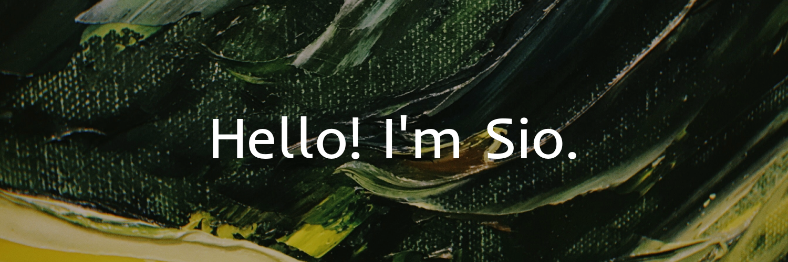

<!--
**SiomiB/SiomiB** is a ✨ _special_ ✨ repository because its `README.md` (this file) appears on your GitHub profile.

Here are some ideas to get you started:

- 🔭 I’m currently working on ...
- 🌱 I’m currently learning ...
- 👯 I’m looking to collaborate on ...
- 🤔 I’m looking for help with ...
- 💬 Ask me about ...
- 📫 How to reach me: ...
- 😄 Pronouns: ...
- ⚡ Fun fact: ...
-->

        

 

        I am a web developer in constant 
        search for new knowledge, with 
        experience in Laravel and SQL. Passionate about 
        music and painting, I like creative 
        solutions and teamwork 

 

        

        

